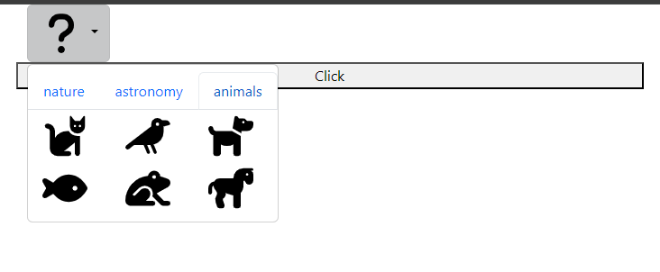
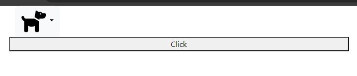

# icons-picker
A library to create an icons picker.

## Dependencies ([jsdelivr](https://www.jsdelivr.com))
- Bootstrap (in HTML head) 
```html
<!--load Bootstrap v5.3.3-->
<link rel="stylesheet" href="https://cdn.jsdelivr.net/npm/bootstrap@5.3.3/dist/css/bootstrap.min.css">
```
- Bootstrap (in HTML body) 
```html
<!--load Bootstrap v5.3.3-->
<script src="https://cdn.jsdelivr.net/npm/bootstrap@5.3.3/dist/js/bootstrap.bundle.min.js"></script>
```
- jQuery (in HTML body) 
```html
<!--load jQuery v3.6.4-->
<script src="https://cdn.jsdelivr.net/npm/jquery@3.6.4/dist/jquery.min.js"></script>
```

## Getting start

Add in HTML head:
```html
<!--load icons-picker v0.0.1 (css file)-->
<link rel="stylesheet" href="https://cdn.jsdelivr.net/gh/DevAI-64/icons-picker@0.0.1/icons-picker.css">
```

Add in HTML script:
```html
<!--load icons-picker v0.0.1 (js file)-->
<script src="https://cdn.jsdelivr.net/gh/DevAI-64/icons-picker@0.0.1/icons-picker.js"></script>
```

With the following folders and files tree:
```
.
├── img/
│   ├── icons/
│   │   ├── default/
│   │   │   ├── question_mark.svg
│   │   ├── nature/
│   │   │   ├── tree.svg
│   │   │   ├── wind.svg
│   │   │   ├── leaf.svg
│   │   │   ├── fire.svg
│   │   │   ├── feather.svg
│   │   ├── astronomy/
│   │   │   ├── moon.svg
│   │   │   ├── globe.svg
│   │   │   ├── meteor.svg
│   │   │   ├── rocket.svg
│   │   ├── animals/
│   │   │   ├── fish.svg
│   │   │   ├── crow.svg
│   │   │   ├── frog.svg
│   │   │   ├── horse.svg
│   │   │   ├── dog.svg
│   │   │   ├── cat.svg
├── index.html
```

The ```<div>``` tag must have ```iconsPicker``` class and ```img/icons``` ***iconsSrc*** attribute (The path to the folders containing images of icons):
```html
<div class="iconsPicker" iconsSrc="img/icons"></div>
```

To instantiate the IconsPicker object and display it with the icons from the previous tree, you must use the following js code:
```js
const icons = {
    "nature": [
        "feather.svg",
        "fire.svg",
        "leaf.svg",
        "tree.svg",
        "wind.svg"
    ],
    "astronomy": [
        "globe.svg",
        "meteor.svg",
        "moon.svg",
        "rocket.svg"
    ],
    "animals": [
        "cat.svg",
        "crow.svg",
        "dog.svg",
        "fish.svg",
        "frog.svg",
        "horse.svg"
    ],
    "default": "question_mark.svg"
}

const iconsPicker = new IconsPicker(icons);
iconsPicker.createIconsPicker();
```
To retrieve the current value of the selected icon (within an event for example) the following method is called:
```js
iconsPicker.getUrlImgChoose();
```

## Exemple
```html
<!DOCTYPE html>
<html lang="en">
  <head>
    <meta charset="utf-8">
    <link href="https://cdn.jsdelivr.net/npm/bootstrap@5.3.3/dist/css/bootstrap.min.css" rel="stylesheet" integrity="sha384-QWTKZyjpPEjISv5WaRU9OFeRpok6YctnYmDr5pNlyT2bRjXh0JMhjY6hW+ALEwIH" crossorigin="anonymous">
    <link rel="stylesheet" href="https://cdn.jsdelivr.net/gh/DevAI-64/icons-picker@0.0.1/icons-picker.css">
    <title>Exemple icons picker</title>
  </head>
  <body>
    <div class="container">
      <div class="row">
        <div class="iconsPicker" iconsSrc="img/icons"></div>
      </div>
      <div class="row">
        <button id="imgURL">Click</button>
      </div>
    </div>
    <script src="https://cdn.jsdelivr.net/npm/bootstrap@5.3.3/dist/js/bootstrap.bundle.min.js" integrity="sha384-YvpcrYf0tY3lHB60NNkmXc5s9fDVZLESaAA55NDzOxhy9GkcIdslK1eN7N6jIeHz" crossorigin="anonymous"></script>
    <script src="https://code.jquery.com/jquery-3.7.1.min.js" integrity="sha256-/JqT3SQfawRcv/BIHPThkBvs0OEvtFFmqPF/lYI/Cxo=" crossorigin="anonymous"></script>
    <script src="https://cdn.jsdelivr.net/gh/DevAI-64/icons-picker@0.0.1/icons-picker.js"></script>
    <script type="text/javascript">
      const icons = {
        "nature": [
          "feather.svg",
          "fire.svg",
          "leaf.svg",
          "tree.svg",
          "wind.svg"
        ],
        "astronomy": [
          "globe.svg",
          "meteor.svg",
          "moon.svg",
          "rocket.svg"
        ],
        "animals": [
          "cat.svg",
          "crow.svg",
          "dog.svg",
          "fish.svg",
          "frog.svg",
          "horse.svg"
        ],
        "default": "question_mark.svg"
      }

      const iconsPicker = new IconsPicker(icons);
      iconsPicker.createIconsPicker();

      document.getElementById("imgURL").addEventListener("click", () => {
        console.log(iconsPicker.getUrlImgChoose());
      });
    </script>
  </body>
</html>
```




Then console displays the path of the dog icon.

*For any suggestions or questions do not hesitate to contact: belaich.david@outlook.fr*
